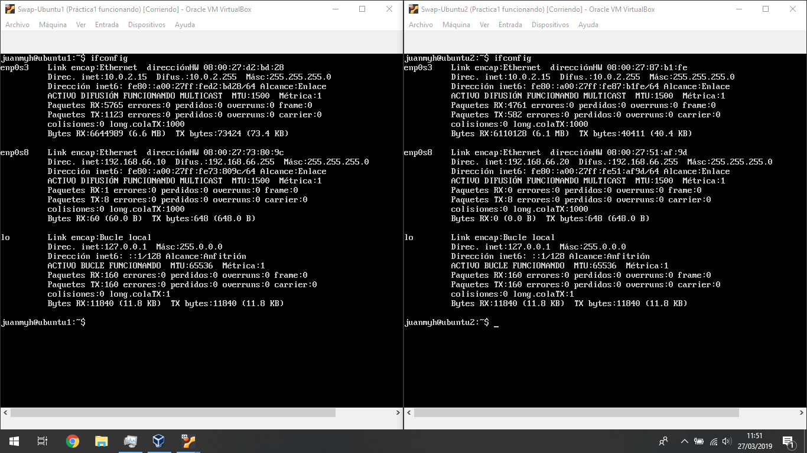
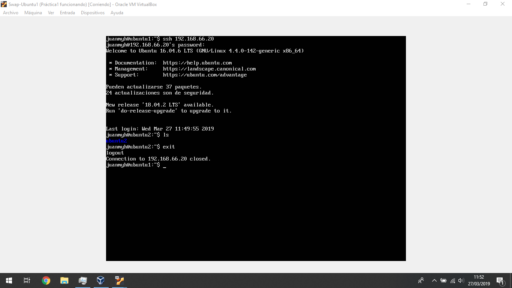
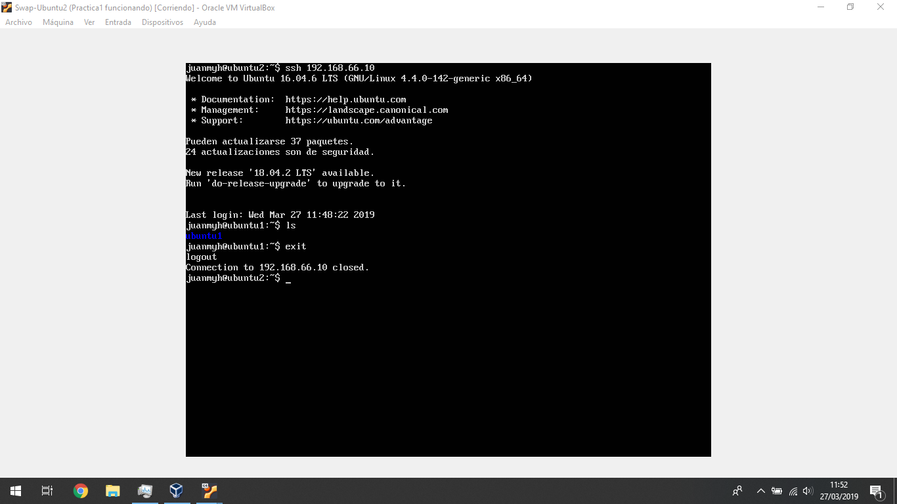
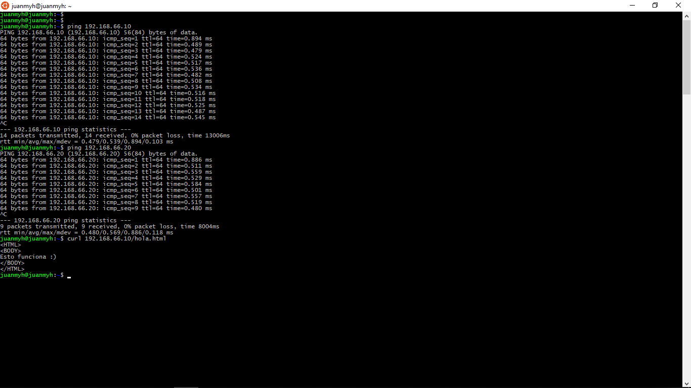

# Práctica 1

En primer vamos a especificar cuales son las dos  máquinas con las que vamos a
trabajar, en ambas hay usuario, que será el mío y es el usuario juanmyh
sus respectivos nombres son: ubuntu1 y ubuntu2 y cuentan con las siguientes
direcciones IP:

ubuntu1   192.168.66.10
ubuntu2   192.168.66.20

como podemos comprobar en la siguiente imagen

## Acceso mediante ssh

Ahora vamos a demostrar que se puede acceder por medio de ssh desde una máquinas
hasta la otra, para ello además del nombre en el prompt tengo una carpeta vacía
en cada máquina con el nombre de la máquina.

Acceso desde ubuntu1 a ubuntu2

Acceso desde ubuntu2 a ubuntu1

NOTA: en esta imagen vemos que no me pide contraseña para acceder por ssh y es
debido a que realice primero la práctica 2 por lo que ya está realizado dicho
apartado

## Acceso mediante curl

Ahora por último para acceder desde curl lo vamos a hacer desde nuestra máquina
host para demostrar así también que podemos acceder a ambas máquinas desde
nuestro PC

