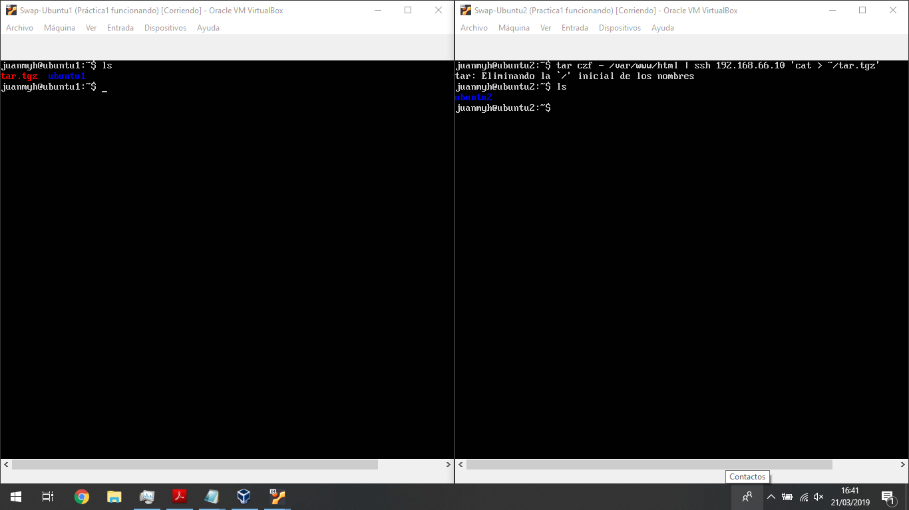
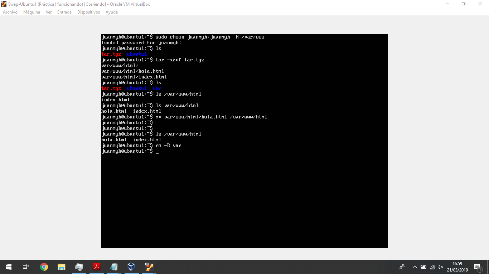
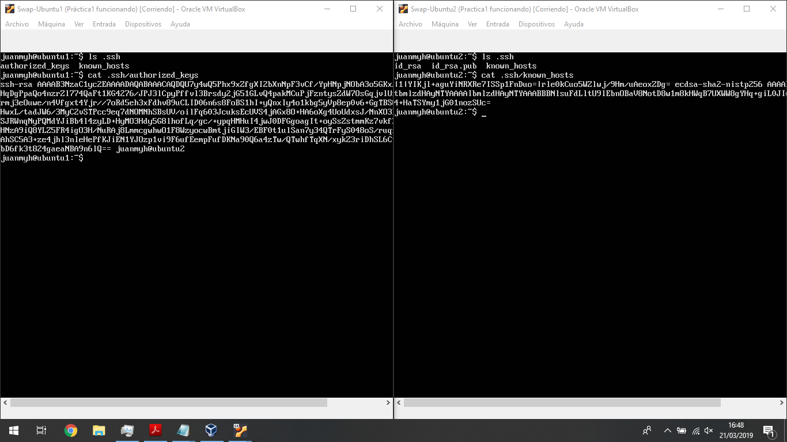
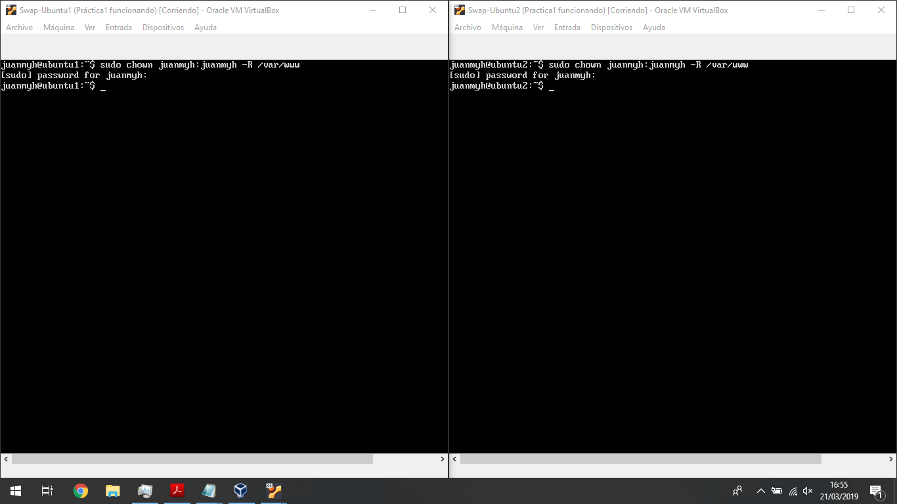
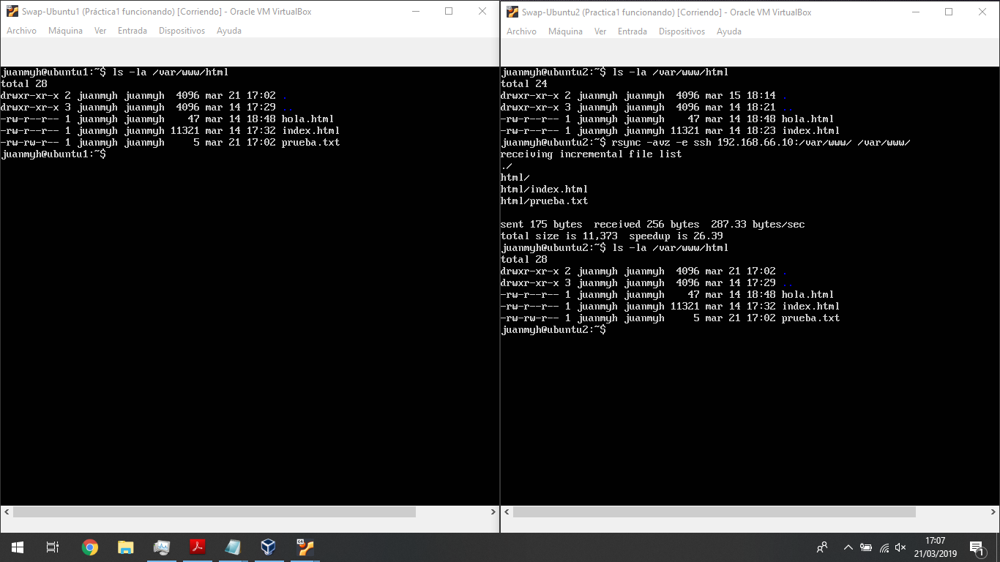
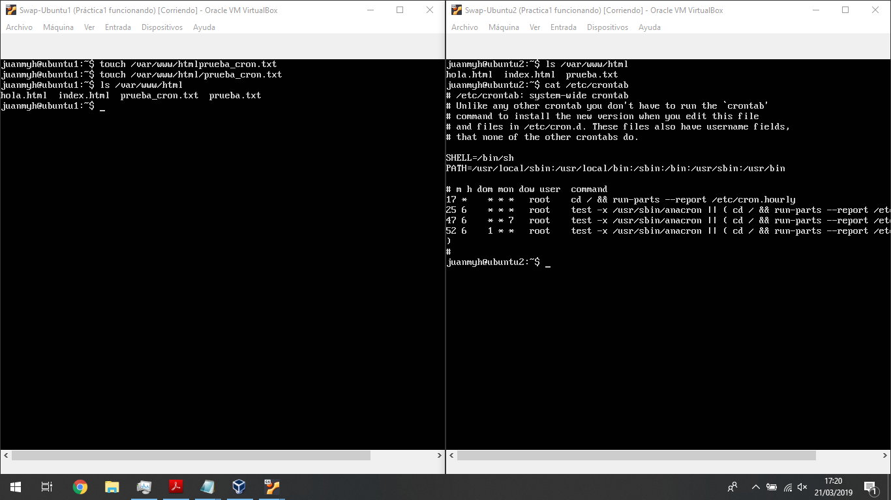
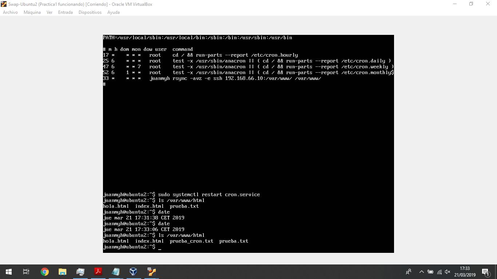

# Practica2

Vamos a dividir el desarrollo de esta práctica en los apartados que
se nos piden.

## Copia de archivos mediante ssh
Dispongo de dos máquinas, llamadas ubuntu1 y ubuntu2 respectivamente,
(en ambas el usuario es juanmyh) tengo el archivo de la práctica 1 hola.html,
pues lo que voy ha hacer para probar este primer apartado es enviarlo
la máquina  ubuntu1

Como primer paso copiamos el archivo comprimiendolo
mediante un tar, y lo enviamos a nuestra máquina ubuntu1

esta seria la manera más tradicional pero como hemos visto en clase no vamos
a usar esta por lo que veremos el resto de forma a ejecutar

Por último mandamos el archivo hola.txt que era lo que diferencia a ambos
moviendolo manualmente desde el tgz que hemos enviado hasta la carpeta web

## Sincronización de ssh

Desgraciadamente este apartado ya lo realice antes de llevar a cabo captura
alguna que corrobore dicho proceso, por lo tanto en lugar de borrar las claves
ssh y volver ha hacerlo, por si acaso me fallase algo por borrar y volver a
crear  las claves públicas y privadas y se quede algún resto lo cual me ocasione
problemas posteriores, cosa que me ha pasado en otras ocasiones, voy a
mostrar capturas del fichero authorized keys que nos muestra efectivamente que
conoce a la máquina2 con usuario juanmyh y nombre ubuntu2.

## Rsync

Primero para la realización de este apartado y como se pide en la práctica
hacemos que nuestro usuario sea el propietario de las carpetas que contienen
los archivos web en ambas máquinas

ahora pues vamos a probar la orden rsync como en ambos directorios tenemos
exactamente lo mismo actualmente, crearemos un fichero de texto plano prueba.txt
para ver que efectivamente usando la orden rsync no los copia desde la máquina1
a la máquina2

efectivamente vemos en la captura como se ha copiado el archivo.

## Crontab

Por último vamos a añadir la tarea con el crontab para que se realice de forma
automática sin nosotros tener que estar ejecutandola manualmente, para ello
en primer lugar vamos a crear un fichero prueba_cron.txt para ver que
efectivamente lo copia cuando llegue el momento a continuación vemos lo que
contiene nuestro fichero crontab actual

ahora visto todo esto añadimos al fichero crontab la nueva orden, que será
la siguiente  
*rsync -avz -e ssh 192.168.66.10:/var/www/ /var/www/*  
reiniciamos el sistema con  
*systemctl restart cron.service*  
para ver que efectivamente nos va bien y esperamos a que se produzca la
clonación en el minuto 33 que es el que hemos designado como se muestra en
la captura final

