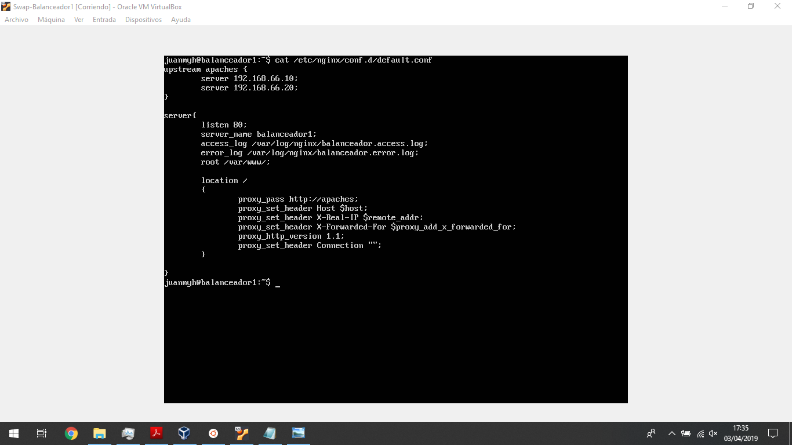
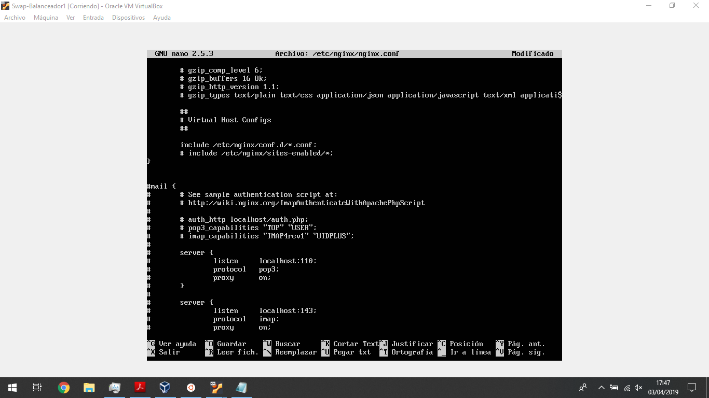
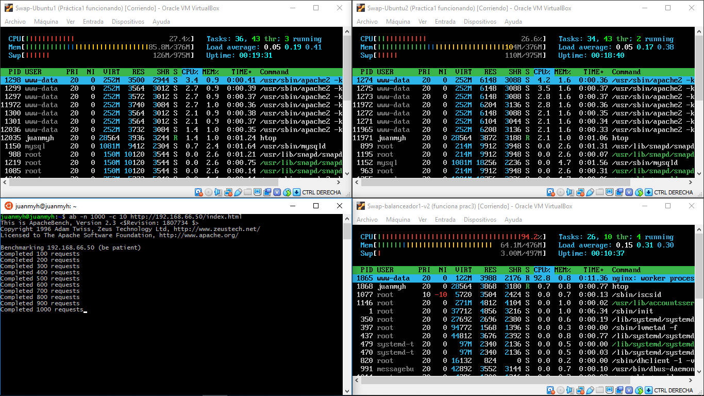
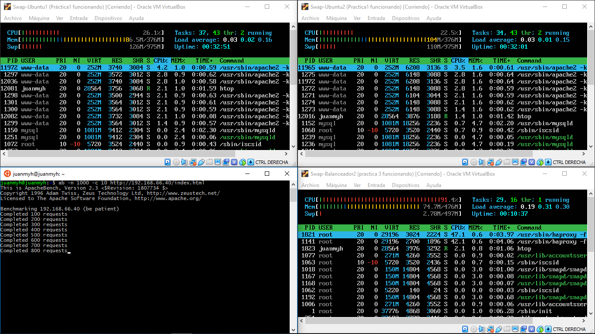
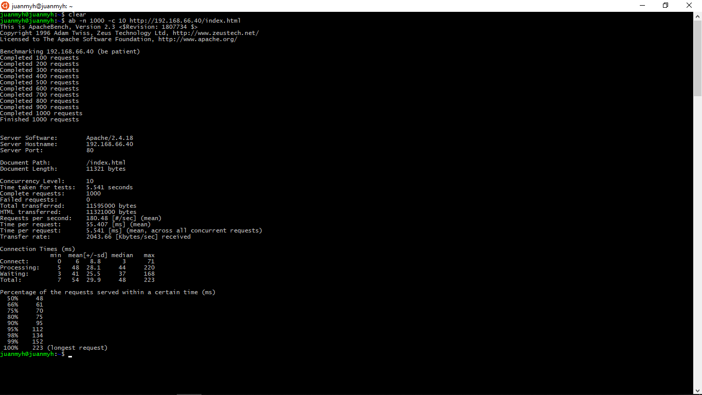

# Práctica 3

En esta práctica vamos a ver como he configurado ambos balanceadores tanto Nginx
como haproxy, y una pequeña comparativa entre ambos en primer lugar y a modo de
esquema voy a poner las máquinas con las que cuento actualmente, y sus
correspondientes IPs

--> Maquinas servidoras
- Ubuntu1         192.168.66.10
- ubuntu2         192.168.66.20

--> Maquinas balanceador
- Balanceador1    192.168.66.50
- Balanceador2    192.168.66.40

## Configuración nginx como balanceador de carga

Para este paso en primer lugar lo que he hecho, es crear una nueva
máquina sin instalarle apache como en la práctica anterior para que
no interfiera con el balanceador que vamos a instalar.

He configurado la ip 192.168.66.50 para esta máquina para poder trabajar con ella

Una vez preparado todo he instalado siguiendo lo que se dice en el guion nuestro
balanceador nginx y he creado el archivo */etc/nginx/conf.d/default.conf* como
se ve en la siguiente captura1

Una vez hecho esto y para evitar que no me funcionase nginx como balanceador he
comentado la última línea del apartado Virtual Host Configs en el archivo
*/etc/nginx/nginx.conf*

con todo ya preparado y tras iniciar nginx vemos con status que esta todo correcto

Ahora si con todo listo vamos a comprobar que efectivamente nginx nos funciona como balanceador, para ello he creado dos archivos de nombre idéntico en mis dos máquinas(ubuntu1 y ubuntu2) *maquinas.txt* el cual tan solo contiene una cadena que dice si es la máquina 1 o la 2 para que cuando accedamos al balanceador, este reparte la tarea de forma correcta, y eso lo podemos ver en la siguiente captura.

Todo este proceso se ha realizado con una configuración de accesos del tipo
round-robin, es decir, de acceso por turnos, pero ahora vamos a probar la
configuración de ponderación asignando a la máquina 1 un valor de 2 y a la máquina 2 un valor de 1, es decir la máquina 1 tendrá el doble de accesos.

Para esto editamos el archivo anterior */etc/nginx/conf.d/default.conf*
añadiendo al final de donde indicamos el server 1 weight=2, en el caso del server 2 no tenemos que añadir nada, ya que por defecto toma el valor de 1.

Ahora vamos a ver como han sido múltiples ejecuciones con dicha configuración

 

## Configuración haproxy como balanceador de carga

De nuevo creamos una nueva máquina en la cual instalar haproxy como balanceador de carga sin instalar apache.

En esta he configurado la ip 192.168.66.40 para poder trabajar con ella.

Una vez preparado todo instalamos haproxy siguiendo las instrucciones del guion
y una vez instalado editamos el archivo de configuración */etc/haproxy.cfg*.

Una vez hecho esto lanzamos el servidor haproxy a ver si hay algún error

Y vemos que no nos sale ningún error, tan solo un par de warnings avisando que algunos comandos de esos se van a quedar obsoletos en futuras versiones.

Con todo ya listo vamos a comprobar si haproxy funciona correctamente como balanceador usando el acceso mediante curl al mismo archivo que en el caso anterior (maquina.txt)

Efectivamente vemos que funciona de forma igual que nginx con round-robin

## Benchmark de los balanceadores

### Nginx

Vamos a visualizar una ejecución concreta del benchmark, desde la máquina anfitriona hacia el balanceador y como se ven tanto las máquinas servidoras como el balanceador con la orden htop mostrando los recursos del sistema

El resultado final obtenido en el programa benchmark ha sido el siguiente

### Haproxy

Ahora vamos a visualizar como ha sido la ejecución del benchmark haciendo uso del balanceador haproxy de la misma forma que hemos hecho en el apartado anterior

El resultado en ese caso del programa benchmark ha sido el siguiente

### Comparativa

Finalmente y para comparar ambos balanceadores, he realizado un pequeño script (script.sh)
el ejecuta el benchmark 10 veces y nos almacena los tiempos en dos archivos distintos
uno relacionado al balanceador1 es decir nginx y otro del balanceador2 haproxy.

Los tiempos obtenidos son los siguientes

| Nginx      | haproxy    |
| ---------- | ---------- |
| 3.317      | 3.389      |
| 3.421      | 3.317      |
| 3.260      | 3.331      |
| 3.293      | 3.071      |
| 3.358      | 3.065      |
| 3.291      | 3.061      |
| 3.356      | 3.039      |
| 3.346      | 3.033      |
| 3.324      | 3.146      |
| 3.264      | 3.049      |

Con lo que los tiempos medios para cada balanceador son

- nginx     3.323
- haproxy   3.1501

Con lo que con esta pequeña comparativa podemos decir que haproxy es más eficiente.
