# Práctica 4

Antes de comenzar voy a identificar cada una de las IP's de las máquinas que
se van a usar:

- Máquina servidor 1    -- ubuntu1        192.168.66.10
- Máquina servidor 2    -- ubuntu2        192.168.66.20
- Máquina balanceador 1 -- balanceador1   192.168.66.50

Una vez identificadas las máquinas vamos a comenzar con los dos apartados
de la práctica.

## Certificado SSL autofirmado

En primer lugar seguimos las instrucciones del guion y creamos los dos
archivos(*apache.crt* y *apache.key*) en la ubicación  */etc/apache2/ssl*
como muestra la captura, además podemos ver que efectivamente el contenido
que tiene es el de una clave generada.

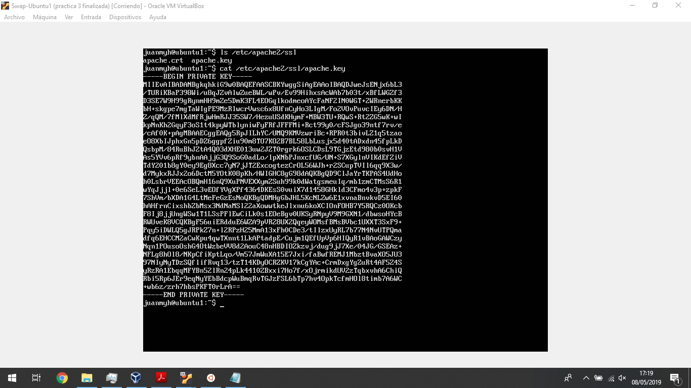

A continuación modificamos el archivo de configuración añadiendo las
dos nuevas líneas :
*SSLCertificateFile /etc/apache2/ssl/apache.crt
SSLCertificateKeyFile /etc/apache2/ssl/apache.key*

justo debajo de *SSLEngine on* como podemos ver en la siguente captura.

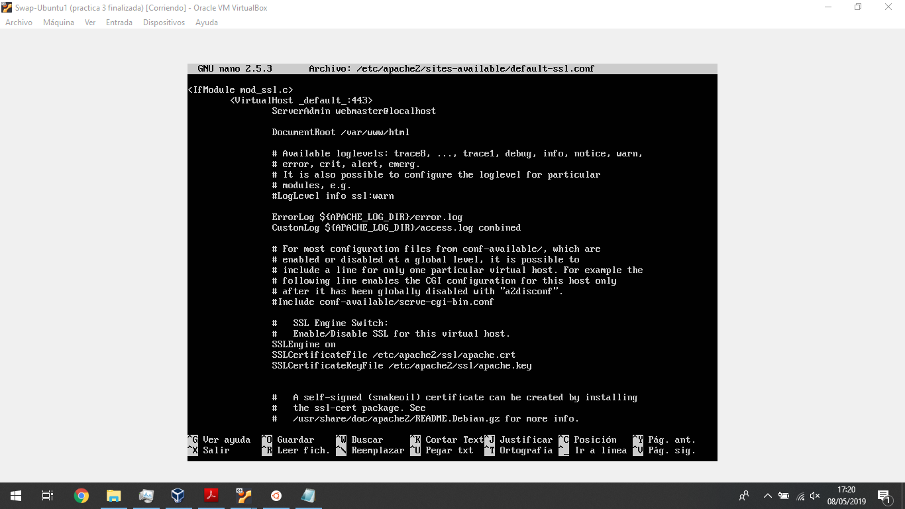

Ahora activamos el sitio como y reiniciamos apache con las siguientes ordenes:
*a2ensite default-ssl
service apache2 reload*
Luego vamos a comrpobar que funciona correctamente por medio del acceso curl.

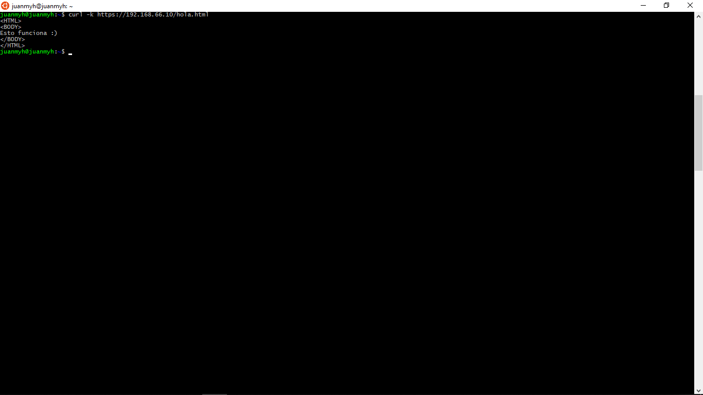

En adición para ver que ocurre vamos a probar ha hacerlo desde el navegador.

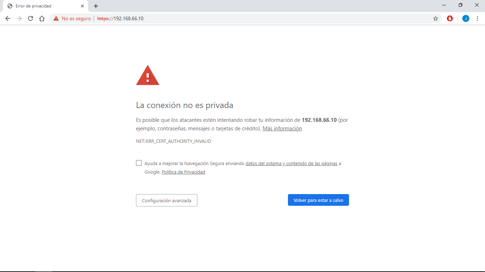

Donde efectivamente vemos que el navegador nos avisa que se trata de un certificado
auto validado.

Ahora vamos ha hacer que se pueda acceder por https directamente desde nuestro
balanceador, para ello copiamos los archivos *apache.crt* y *apache.key*
a nuestra máquina servidora 2  y ejecutamos lo mismo de antes, además de
modificar el fichero de configuración tal y como hicimos antes.

Una vez listo nuestro servidor2 copiamos los archivos al balanceador1 y
añadimos las siguientes líneas:

*listen 443 ssl;
ssl on;
ssl_certificate /tmp/apache.crt;
ssl_certificate_key /tmp/apache.key;*

al archivo de configuración de nginx como muestra la captura.

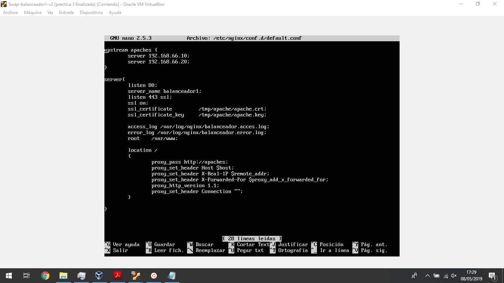

Una vez todo preparado vamos ha acceder por https por la ip del balanceador
para comprobar que todo esta correcto.

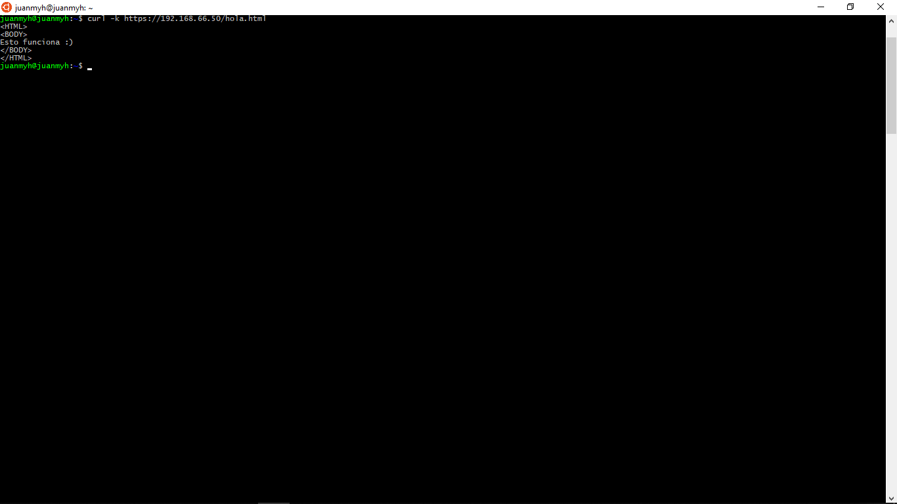

Efectivamente funciona y así terminamos este apartado.

## Configuración del cortafuegos con iptable

Ahora para la realización de este apartado en nuestra máquina 1 vamos a poner
un cortafuegos de forma que tan solo se pueda acceder por medio de HTTP, HTTPs
y SSH.

Para ello haremos uso del siguiente script :

`# (1) Eliminar todas las reglas (configuración limpia)
iptables -F
iptables -X
iptables -Z
iptables -t nat -F
# (2) Política por defecto: denegar todo el tráfico
iptables -P INPUT DROP
iptables -P OUTPUT DROP
iptables -P FORWARD DROP
# (3) Permitir cualquier acceso desde localhost (interface lo)
iptables -A INPUT -i lo -j ACCEPT
iptables -A OUTPUT -o lo -j ACCEPT

# (4) Abrir el puerto 22 para permitir el acceso por SSH
iptables -A INPUT -p tcp --dport 22 -j ACCEPT
iptables -A OUTPUT -p tcp --sport 22 -j ACCEPT
# (5) Abrir los puertos HTTP (80) de servidor web
iptables -A INPUT -p tcp --dport 80 -j ACCEPT
iptables -A OUTPUT -p tcp --sport 80 -j ACCEPT
# (6) Abrir los puertos HTTPS (443) de servidor web
iptables -A INPUT -p tcp --dport 443 -j ACCEPT
iptables -A OUTPUT -p tcp --sport 443 -j ACCEPT`

Para hacer que dicho script se ejecute cuando se lanza el sistema, haremos uso
del fichero *rc.local* situado en */etc/rc.local* añadiendo la ejecución del
script a dicho fichero como vemos en la captura2.

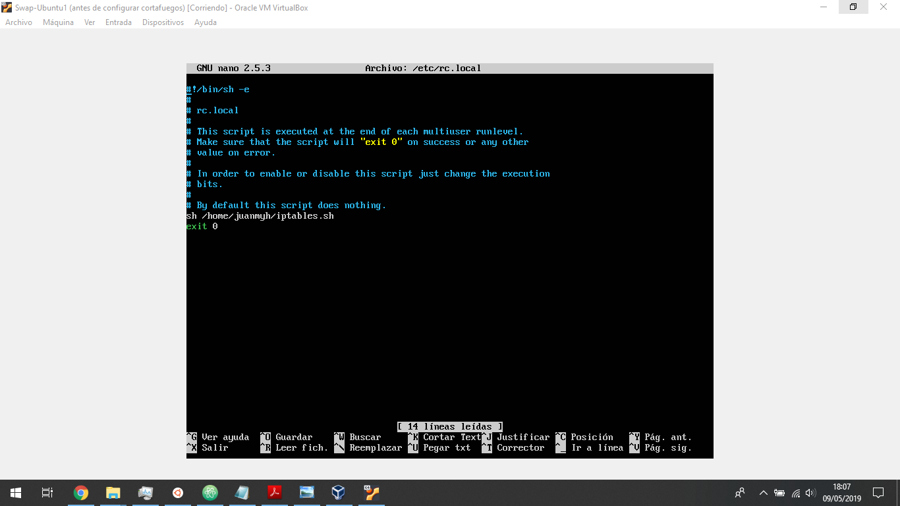

Ya esta todo listo, ahora para comprobar que funciona correctamente vamos a hacer
dos ejecuciones distintas, una en la que comentamos el apartado 6 del script
para ver si efectivamente nos bloquea el acceso por https y otra final con el
script completo para ver que funciona correctamente.

Comprobamos la primera opción (comentando apartado 6).

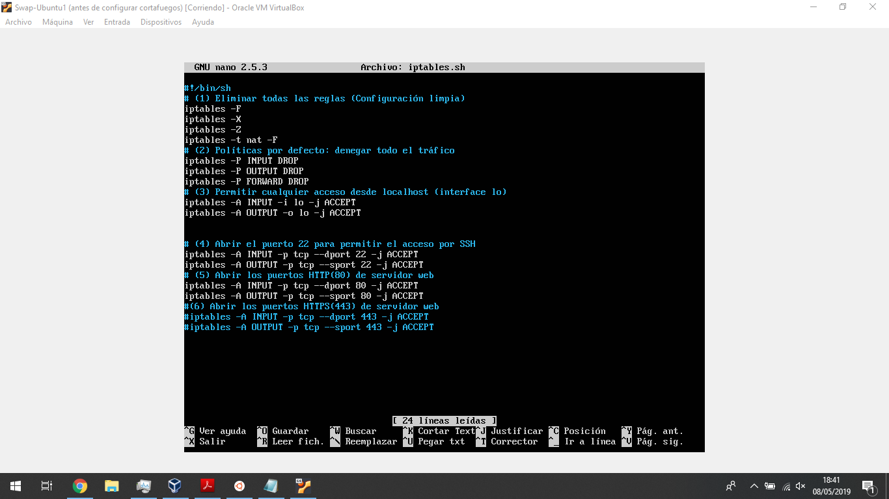
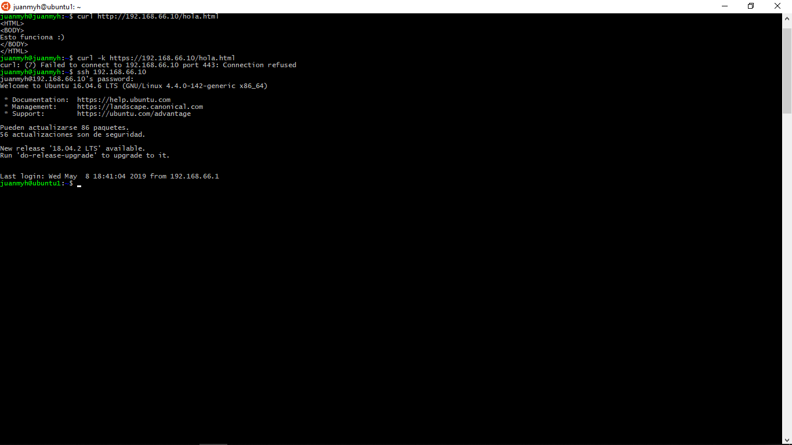

Efectivamente vemos que en la ejecución nos permite entrar por http y por ssh
pero no nos deja hacerlo por https.

Ahora por último vamos a probar el acceso con el script completo para ver
si ahora si nos deja acceder por medio de https.

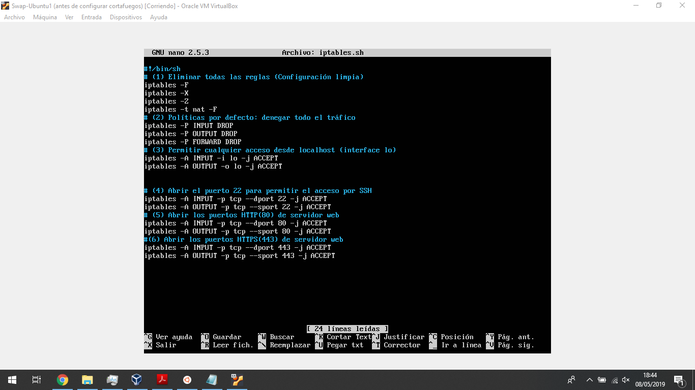
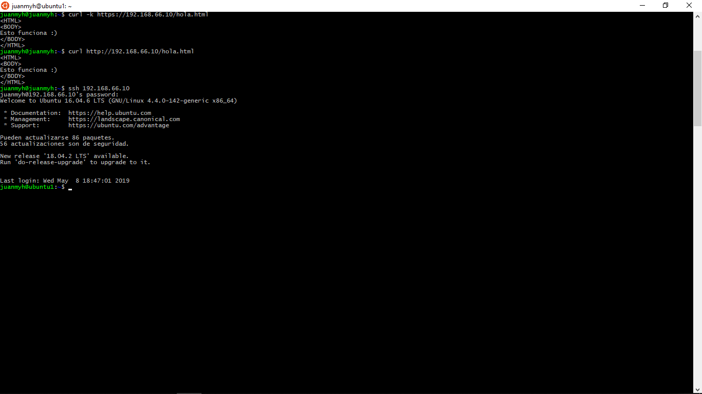

Como vemos en las capturas, ahora si nos deja acceder, por lo que damos la
práctica por finalizada.
