# Práctica 5

Para esta práctica vamos a usar las siguientes máquinas:

- ubuntu1   192.168.66.10
- ubuntu2   192.168.66.20

## Creación de la base de datos

En primer lugar lo que hacemos es crear la base de datos, accediendo a sql
mediante la orden *mysql -u root -p* una vez dentro creamos la base de datos
la cual hemos denominado contactos, y le añadimos una tabla, tal y como se muestra
en la siguiente captura.

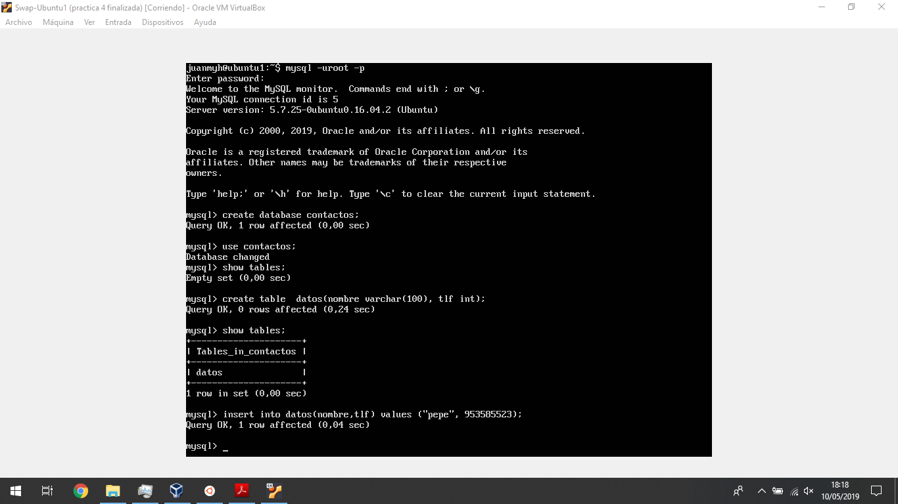

Acto seguido añadimos a la tabla algunos valores de prueba, y además vemos su
distribución.

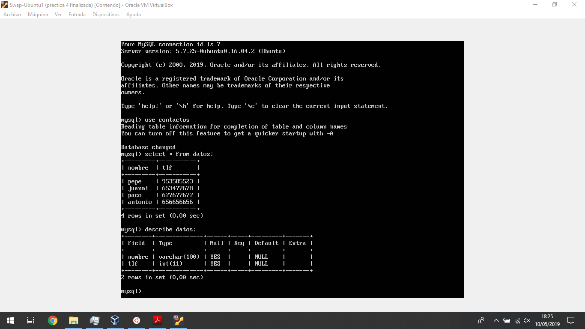

Una vez creada ya la base de datos, vamos a guardarla en un archivo .sql para
poder mandarla a nuestra máquina2 y comenzar a operar con ellas, para ello
primero evitamos el acceso a la BD para que no se vaya a cambiar nada, y a
continuación creamos el archivo .sql y volvemos a desbloquear las tablas, tal
y como se muestra en las dos siguientes capturas.

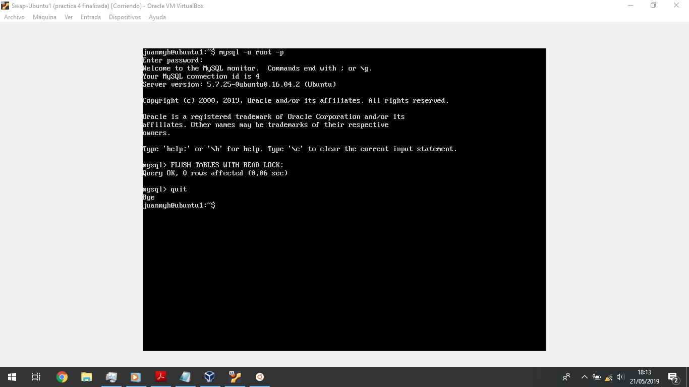
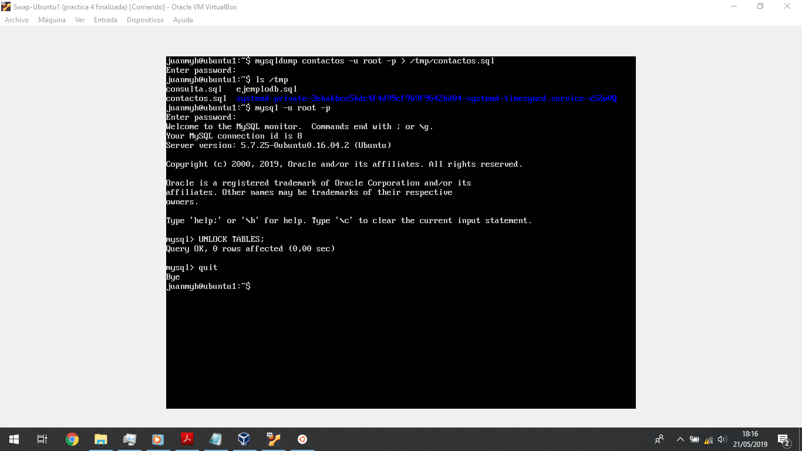

Una vez listo mandamos el archivo creado a nuestra máquina2, para ello he usado
sftp, y con el archivo ya en nuestra máquina2 creamos la misma base de datos,
es decir con el mismo nombre para que no vayamos a tener problema alguno,
y usamos la orden *mysqldump* para guardar lo que tenemos en el archivo que hemos
pasado a nuestra base de datos creada como podemos ver en la siguiente captura.

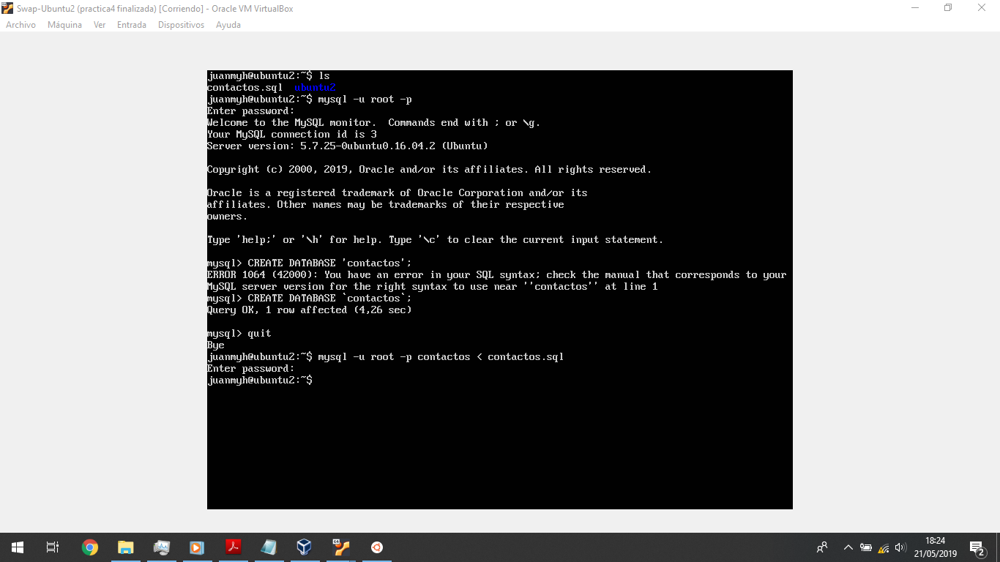

Una vez lista la base de datos en la máquina2 la comprobamos para ver que
efectivamente es igual a la que tenemos en nuestra máquina1(captura2).

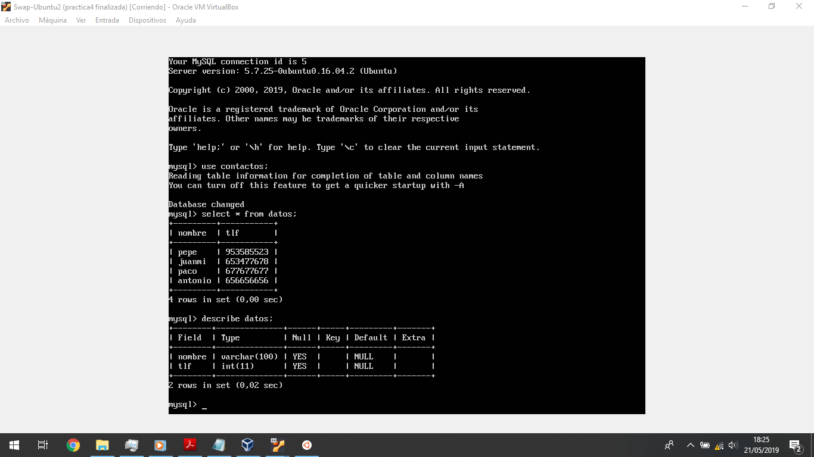

Con eso dejamos ambas máquinas preparadas y terminamos este apartado.

## Configuración maestro-esclavo

Antes de empezar y para evitar posibles errores vamos a comprobar que ambas
máquinas tienen la misma versión de mysql.

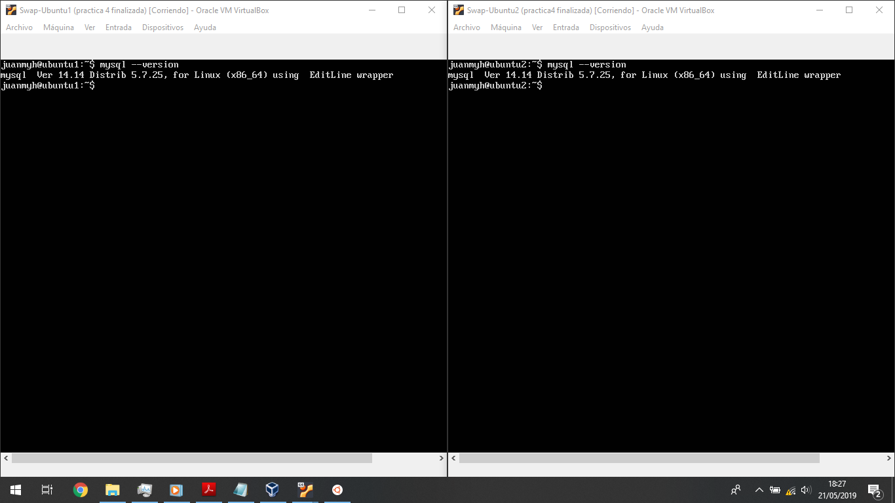

Una vez visto esto, vamos a configurar nuestra máquina ubuntu1 como el servidor
maestro, para ello editamos el archivo */etc/mysql/mysql.conf.d/mysqld.cnf* y
reiniciamos el servicio mysql para ver si esta todo correcto.

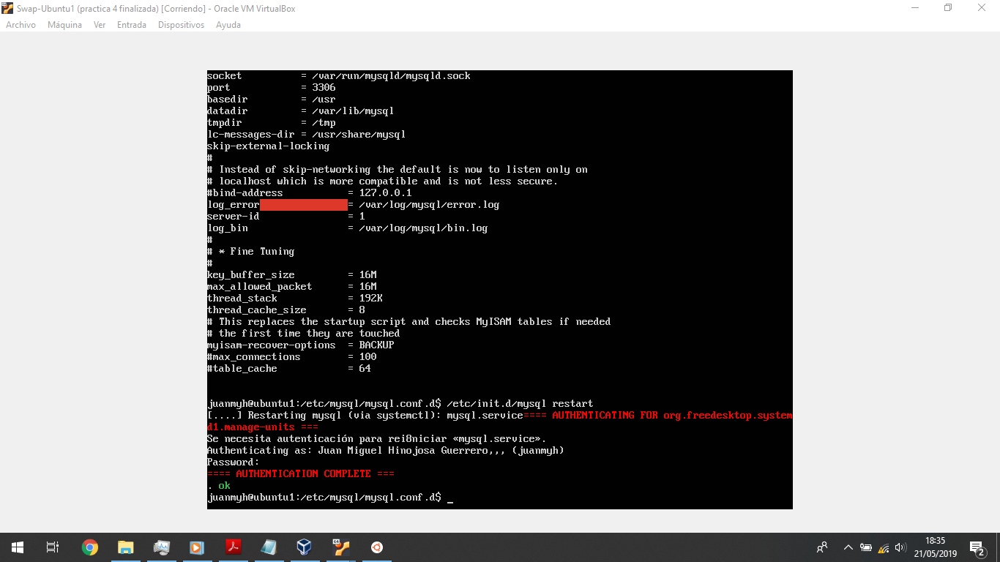

como vemos en la captura después de reiniciar nos dice que todo esta ok, ahora
vamos a hacer lo mismo en la máquina2 con la excepción de que en server-id
pondremos 2.

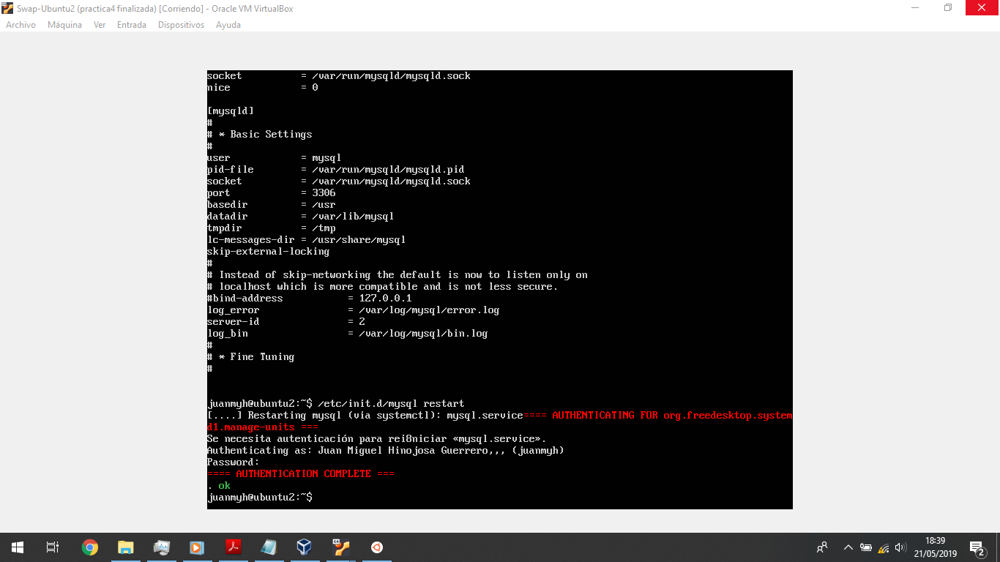

además una vez listo reiniciamos mysql y vemos en la captura anterior que de
nuevo todo está bien.

Una vez listos ambos ficheros de configuración, vamos a crear nuestro usuario
esclavo y configurarlo para asignárselo a la máquina2.

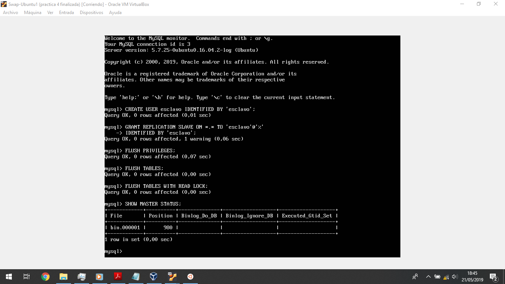

además vemos la información del status del master, información que nos hará falta
ahora para poder configurarlo en nuestra máquina2.

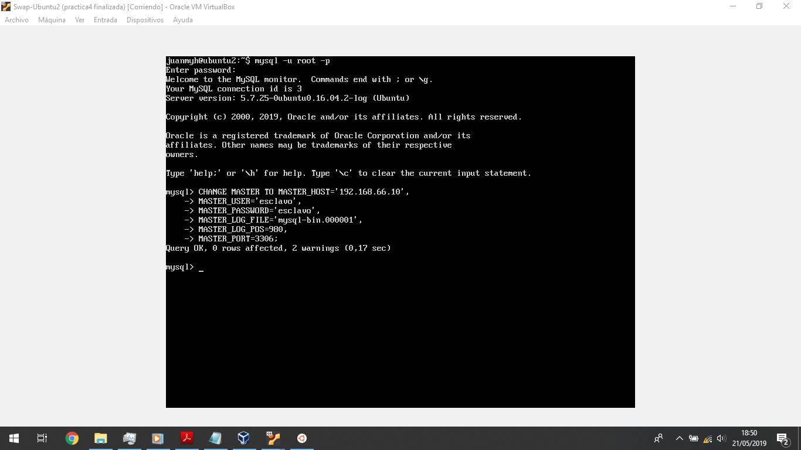

lo hacemos y obtenemos dos warnings los cuales vienen a decirnos que no es
aconsejable usar la contraseña con texto plano.

Listo ya todo esto vamos a ver si se ha configurado correctamente viendo que
el valor de la variables *Seconds_Behind_Master* es distito de NULL, para ello
he cambiado a usar una terminal del pc host conectada por ssh a la máquina2
para poder hacer scroll y ver el contenido entero.

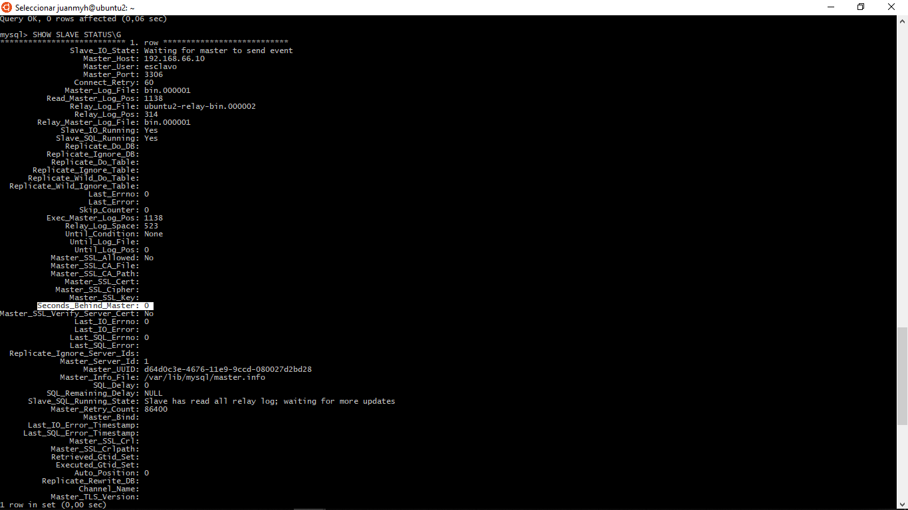

Como vemos el valor es distinto de NULL por lo que debería de funcionar, para
comprobarlo ahora de modo práctico, vamos a ver ambas tablas y hacer una
inserción en una de ellas para ver si realmente se cambia en la máquina2 sin
hacer la inserción allí.

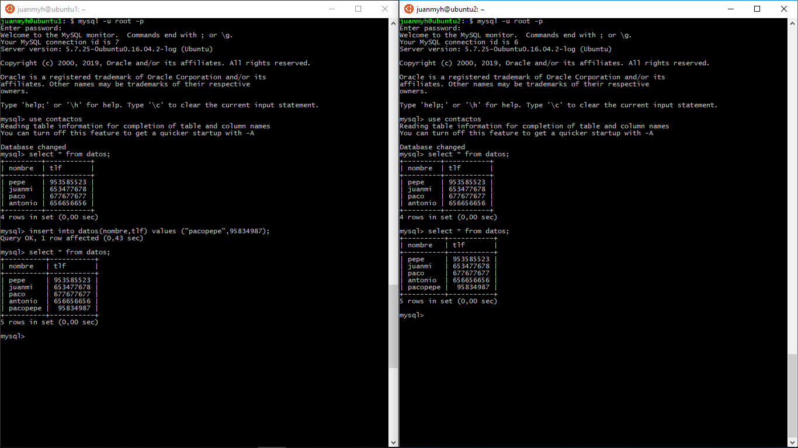

Efectivamente la inserción también se actualiza en nuestra máquina2, así pues
damos está práctica por finalizada.
